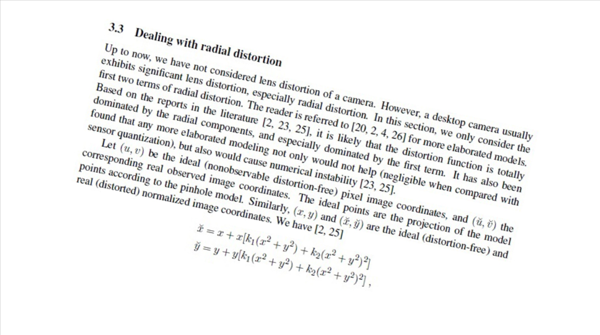

# DNN_OpenCV_learning_repo

This is an repository to learn the OpenCV and Deep Neural network.  This repo is used to implement some useful applications like `face mask detection`, `image beatiful filter` and `image correction`. It will be continuously updated. 

## face mask detection

This is a face mask detection repository and it is derived and improved from the website [COVD-19:FACE Mask DETECTOR](https://www.pyimagesearch.com/2020/05/04/covid-19-face-mask-detector-with-opencv-keras-tensorflow-and-deep-learning/).


The structure of the project is below:

```
.
├── dataset
│   ├── with_mask
│   └── without_mask
├── detect_mask_image.py
├── detect_mask_video.py
├── examples
│   ├── example_01.png
│   ├── example_02.png
│   ├── example_03.png
│   └── example_04.png
├── face_detector
│   ├── deploy.prototxt
│   └── res10_300x300_ssd_iter_140000.caffemodel
├── LICENSE
├── mask_detector.model
├── plot.png
├── README.md
└── train_mask_detector.py

5 directories, 13 files
```

## detectQRCode
This is a QR code detection based on the OpenCV 4.2. The OpenCV 4.2 provides the function to detect. 

```
bool cv::QRCodeDetector::detect(InputArray  img,
                                OutputArray  points 
                                )

string cv::QRCodeDetector::decode(InputArray  img,
                                    InputArray  points,
                                    OutputArray  straight_qrcode = noArray() 
                                    )

string cv::QRCodeDetector::detectAndDecode(InputArray  img,
                                            OutputArray  points = noArray(),
                                            OutputArray  straight_qrcode = noArray() 
                                            )

```


The steps for the QR code detection are:
1. Image binary. 
2. Identify the QR code using QRCodeDetector.detect().
3. Using the QRCodeDetector.decode() to detect the QR code information.
4. Output the QR code information.

## face detector
This is a face detector to use OpenCV to perform face recognition. To build the face recognition system, firstly it performs face detection, extract face embeddings from each fae using deep learning, train a face recognition model on the embeddings, and then finally recognize faces in both images and video streams with OpenCV. 

```
.
│  deploy.prototxt.txt
│  detect_faces.py
│  detect_faces_video.py
│  iron_chic.jpg
│  list.txt
│  res10_300x300_ssd_iter_140000.caffemodel
│  rooster.jpg
│  
└─
```

## image_beautiful_filter
This is an application using the OpenCV to revise the image called beautiful filter. 


## Image_correction 

The project contains image correction, text correction and the text correction has two methods. The method is derived from the [blog](https://www.cnblogs.com/skyfsm/p/6902524.html). 

The file contains:

```
│  1.png
│  2.png
│  3.jpg
│  CMakeLists.txt
│  image_correction.cpp
│  list.txt
│  pDstFileName.jpg
│  rectified.jpg
│  roated_image_1.jpg
│  rotated_image.jpg
│  text_correction.cpp
│  text_correction_FFT.cpp
```


**Image correction:**

1. image grayscale
2. the image binary
3. detect the contour
4. find the outline matrix and get the angle
5. rotation correction based on the angle
6. extract the contour of the rotated image
7. cut out the image area within the outline and output the image. 

The effect after the `image_correction` is shown below:

`raw image`：


`binary_image`:


`rotated_image`


`output_image`


**text_correction:**

1. image grayscale and binary
2. contour detection 
3. using the Hough transformation to detect the center of the image.
4. clip the image and rotate

`original image`




`Hough transformation`


`output`


## remove_photo_flaw

The `remove_photo_flaw` is used to remove the image flaw. 

`raw image`


`output`


